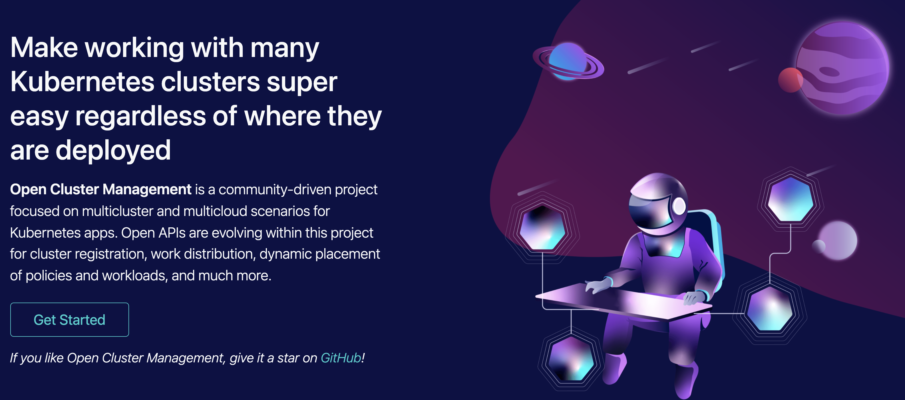
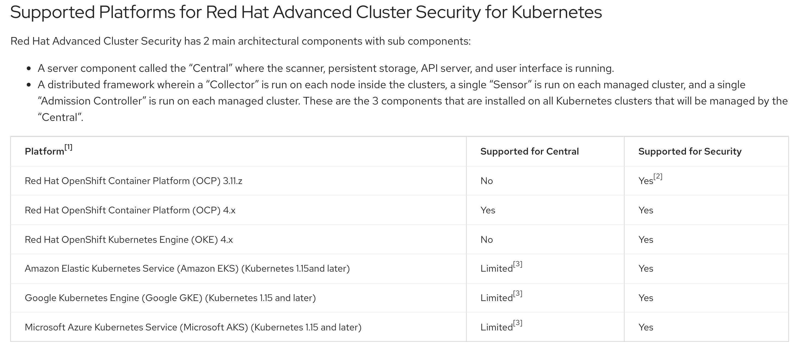
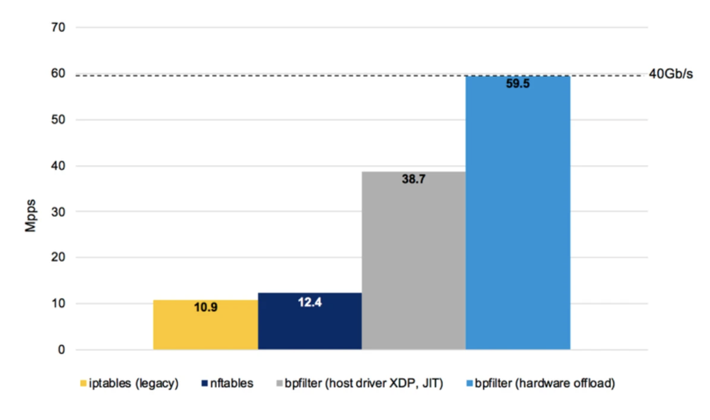
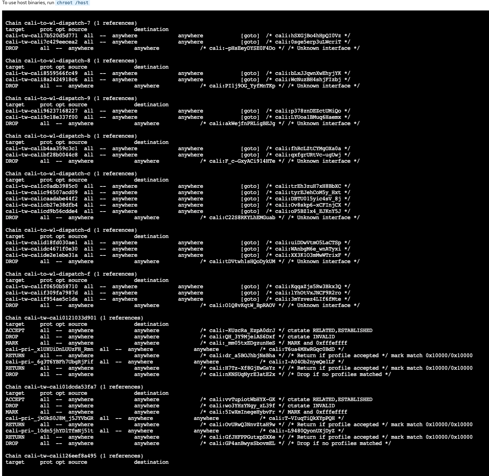
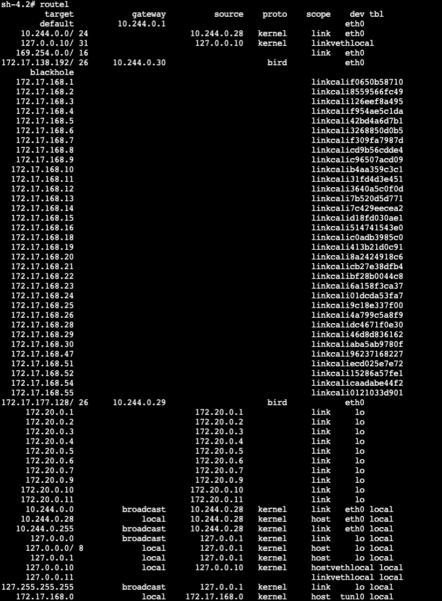
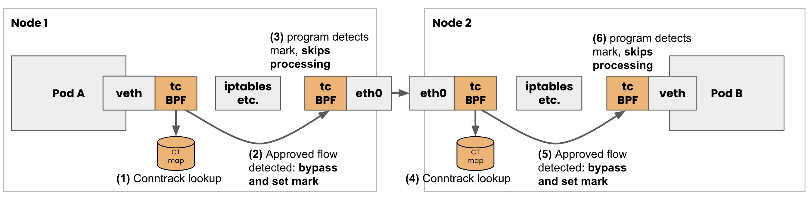

## Application ที่พร้อม Scale ก็ต้องเสริมความมั่นใจด้วย Security ที่ช่วยตรวจสอบการทำงานในทุกจุด
ปัจจุบันการ Deploy Application ในรูปแบบของ Container นั้นเป็นรูปแบบทีไ่ด้รับความนิยมสำหรับ Project ที่ต้องการคุณสมบัติการ Scale ที่ยืดหยุ่นสามารถ Deploy ได้ง่ายไม่ยึดติดกับ Host หรือ Virtual Machine ที่ทำงานอยู่ ซึ่งด้วยความสะดวกของการ Scale Application ในรูปแบบของ Container ก็ทำให้เรามี Application ที่ถูก Scale Out ออกไปหลายๆแอพและไม่จำเป็นต้องอยู่ในเครื่องเดียวกันก็ได้ แต่กระนั้นเองก็อาจจะเป็นการเพิ่ม Attack Surface ได้เช่นเดียวกันเพราะ Application ไมไ่ด้อยู่แค่ที่ Host Machine เครื่องเดียวอีกต่อไป ซึ่งถ้าหาก Application ที่เรา Deploy ไปนั้นมีช่องโหว่ Vulnerability ในหลายๆที่หลายเครื่อง Machine ตามไปด้วย แต่ไม่ใช่หมายความว่าการ Scale Out Application เป็นสิ่งไม่ดีนะ TwT  เพียงแต่เป็นเรื่องความจริงของ Application ที่อยู่ในรูปแบบ Distributed อยู่แล้วนั่นเองคับผม  ซึ่งก่อนส่งท้ายปี 2021 ที่ผ่านมาเราคงจะจำอภิมหากาฬช่องโหว่ Vulnerability อย่าง Log4Shell ที่อยู่ใน Library ของ Log4J ใน Java นั่นเองซึ่งก็กระทบแทบจะเกือบทุก Application ในแพลตฟอร์มใหญ่ๆที่เราใช้งานทั้งหมดซึ่งสำหรับวิธีการแก้ไขที่ดีที่สุดเลยก็คือการที่เรารีบอัพเกรด Library ของเราให้ไปยัง Version ล่าสุดที่ผ่านการแก้ไขช่องโหว่นี้เรียบร้อยแล้วกับคอยตามช่องโหว่อยู่ตลอดเวลา ซึ่งความยิ่งใหญ่นี้ถึงขนาดที่เว็บไซต์อย่าง Docker Hub ที่ใช้สำหรับฝาก Container Image นั้นมีขึ้นแจ้งเตือน Log4Shell ไว้ที่ตรง Tag ของ Image ที่จะ Pull เลยทีเดียว ซึ่งก็เป็นการช่วยให้เราอุ่นใจได้มากขึ้นสำหรับ Image ใหม่ๆที่เราจะ Pull ลงมาแต่ถ้าหากเราใช้ Private Registry ทั่วๆไปที่เราใช้ในการฝาก Container Image เฉยๆหรือว่า Image ของเรานั้นถูกรันทำงานใน Cluster ไปตั้งนานแล้วเราก็คงจะไม่ทราบว่าแล้ว Image ที่กำลังทำงานอยู่นั้นปลอดภัยดีหรือเปล่าจากช่องโหว่ Log4Shell 

ซึ่งวันนี้เองเราจะลองมาทดลองใช้ Product  Red Hat Advance Cluster Security ซึ่งเป็นส่วนของ Project Opensource ชื่อว่า Open Cluster Management ซึ่งตอนนี้กำลังเป็น Sandbox Project ของ Cloud Native Computing Foundation https://open-cluster-management.io 



ซึ่งไว้เดี่ยวครั้งหน้าเราจะลองมาใช้ Project Open Cluster Management ในการควบคุม Deploy Application ไปหลายๆ Cluster พร้อมกับ Rule เงื่อนไขการ Deploy กันคับผม ซึ่งสำหรับวันนี้ส่วนที่เราจะลองมาเดโม่กันคือส่วนของ Advance Cluster Security ที่ลิ้งค์นี้ https://github.com/stolostron/advanced-cluster-security แต่สำหรับ Demo ครั้งนี้เราจะใช้ Operator ที่อยู่ใน Openshift Cluster ในการติดตั้ง Product Red Hat Advance Cluster Security ซึ่งเป็น Version ที่มี Subscription และได้รับการ Support การใช้งานดูแลจาก Red Hat กันว่าถ้าอยากลอง Config ใช้งานแบบง่ายๆสำหรับสร้าง Rule กฏสำหรับการตรวจจับ Log4Shell และช่องโหว่ Security อื่นๆต้องทำอย่างไรบ้าง
โดย Red Hat Advance Cluster Security นั้นสามารถติดตั้งได้ทั้งใน Vanila Kubernetes และ Openshift เองเพียงแต่ว่าสำหรับ GUI Console ที่เป็นเสมือนศููนย์ในการควบคุม Rule และกฏในการ Secure Cluster ถ้าจะลงก็จะลงในตั้งแต่ Openshift 4.5 เป็นต้นไปก็จะ Support แบบเต็มรูปแบบมากที่สุด https://docs.openshift.com/acs/3.67/installing/prerequisites.html ส่วน Cluster ปลายทางที่ต้องเราต้องการ Protect โดยใช้ Rule ที่สั่งมาจาก Central GUI ที่เราจะเรียก Component นี้ว่า SecuredCluster โดยสามารถไปดูรายละเอียดเพิ่มเติมได้ที่ https://access.redhat.com/node/5822721



### Advance Cluster Security ทำงานได้อย่างไรและใช้เทคนิคอะไรเบื้องหลังกันนะ ?
สำหรับตัวอย่างที่เราจะมาทดลองกันในวันนี้จะประกอบไปด้วยของตรวจจับ CVE ช่องโหว่ของ Log4Shell โดยตรงและตรวจจับ Pod ที่มีพฤติกรรมการทำงานแล้วขัดกับกฏที่เราตั้งเอาไว้ใน Cluster อย่างเช่นห้ามมี User ใช้คำสั่งเข้าไปใน Pod โดยตรงเพื่อความปลอดภัยเพราะบาง Pod ก็อาจจะมี ServiceAccount ที่มี Credentials สามารถต่อตรงไปหา Kube API Server ได้อย่างเช่น Pod ที่ใช้ใน Pipeline CI/CD แล้วเราสั่งให้ Pod นั้นสามารถใช้คำสั่ง kubectl หรือเชื่อมไปหา Kube API Server แล้วเกิดเราไม่ได้จำกัดสิทธิจะกลายเป็นว่า Pod ใน Pipeline CI/CD จะกลายเป้นจุดที่น่ากลัวมากเพราะ Pod CI/CD ของเราอาจจะไปลบหรือแอบไป Deploy อะไรก็ได้จาก User หรือใครที่เข้ามาถึง Pod นี้ได้ ดังนั้นเพื่อความปลอดภัยเราก็อาจจะห้ามมีการ exec เข้าไปใน Pod โดยตรงเลยนั่นเอง ซึ่งมาตรงถึงจุดนี้เพื่อนๆก็อาจจะสงสัยบ้างวา เอ๊แล้วมันรู้ได้ยังไงกันนะว่ามันมีอะไรเกิดขึ้นใน Cluster ของเราแล้วมันไปตรงกับกฏได้ยังไงกันนะ ? ซึ่งในปกติแล้ว Kubernetes ก็จะมี Audit Logs ให้เราสามารถเข้าไปดูเหตุการณ์ที่เกิดขึ้นใน Cluster ได้เช่นกัน https://kubernetes.io/docs/tasks/debug-application-cluster/audit และก็จะมี Admission Controller https://kubernetes.io/docs/reference/access-authn-authz/admission-controllers/ ซึ่งเป็นเสมือน Filter ตัวหนึ่งที่มาขั้นในช่วงกลางระหว่างที่ Request ของเราก่อนที่จะถูกส่งไปถึง Kubernetes API Server
โดยเทคโนโลยีเบื้องหลังว่าแล้วการตรวจจับว่า Container ที่ทำงานใน Pod ไหนนั้นไม่ผ่านเป็นไปตาม ซึ่งส่วนประกอบของตัวที่ใช้งานใน Admission Controller อาจจะเป็น Mutating Webhook ที่ใช้ในการเปลี่ยน Config ของ Object ที่กำลังจะเกิดขึ้นมาเช่นเรามีการสร้าง Deployment ที่ไม่ได้ระบุ Resources Limit โดยปกติก็จะทำให้ Pod ใช้งาน Resources ไปเรื่อยๆตามใจก็อาจจะทำให้เกิดปัญหา Resource ไม่พอและแย่งกันใช้ได้นั่นเอง แต่ถ้าเราลองให้ Mutating Webhook บอกว่า ถ้าผู้ใช้ไม่ได้เติม Resources ของ Pod มาก็ช่วยเติมให้หน่อยนะโดย set Limit CPU กับ Memory สูงสุดที่ใช้ไว้นั่นเอง หรืออย่าง Validating Webhook ก็จะทำหน้าที่เหมือนชื่อบอกคือเช็คว่า Object ที่กำลังส่งมานั้นมันเป็นไปตามเงื่อนไขที่จะให้ตรวจสอบ Validate หรือเปล่าถ้าไม่เป็นก็แจ้ง Error บางอย่างกลับไปนั่นเอง


### eBPF (Extended Berkeley Packet Filter) หัวใจสำคัญ Monitoring ของ Linux ยุคใหม่ (รวมถึง Microsoft Windows ??!!)
สำหรับอีกคำถามหนึ่งหลังจากที่เรามีการตรวจจับหรือ Block จังหวะขาเข้ากำลังจะสร้าง (Deploy-Time) Object ไปยัง Kubernetes API Server ได้แล้วผ่าน Admission Controller เรามีเทคนิคอะไรอีกในการตรวจจับสิ่งที่ทำงานไปแล้ว (Run-time) ? 
และสำหรับการเก็บข้อมูลในจังหวะที่ Pod ของเรานั้นทำงานไปใน Cluster แล้วจะใช้เทคโนโลยีที่อยู่ใน Linux อยู่แล้วที่ชื่อว่า eBPF (Extended Berkeley Packet Filter) ซึ่งจริงๆแล้วก็เกิดมาจาก BPF (Berkeley Packet Filter) ที่ในตอนแกรเกิดมาสำหรับการเขียน Rule ในการทำ Routing ภายในตัว Linux เองโดยถ้านึกถึงเรื่องใกล้ตัวก็คือคำสั่งที่เกี่ยวข้องกับ iptables ที่ใช้ในการทำ NAT หรือการ drop Package ระหว่าง Interface ต่างๆภายใน Linux นั่นเองซึ่งตัวอย่างที่ดังๆและน่าสนใจก็อย่างเช่น Cloud Flare ที่นำ eBPF มาผสมกับ Nftables ซึ่ง Nftables เองก็กำลังจะกลายเป็นตัวกฏ Routing หลักของ Linux ในอนาคต https://wiki.nftables.org/wiki-nftables/index.php/Moving_from_iptables_to_nftables ซึ่งเพื่อนๆสามารถไปดูได้จากเว็บของ Netfilter ที่เป็นทั้งผู้พัฒนา Nftables กับ Iptables อยู่แล้ว แต่ถึงกระนั้นเองผมก็เจอบั้คกับ Docker นะตอนไปใช้ Nftables TwT คือ Service Discovery ไม่ทำงานเลยแต่เหมือนตอนนี้จะแก้ได้แล้วล่าสุดบน Fedora35 (แต่ผมยังไม่เคยเทสเหมือนกันนะว่าแก้ได้จริงมั้ยนะ เคยแต่ลองสมัยก่อนประมาณสองปีก่อน TwT ) https://fedoramagazine.org/docker-and-fedora-35/ 


ซึ่งสำหรับเหตุผลสั้นๆง่ายๆว่าทำไม Iptables มันช้าและต้องอัพเกรดมาเป็น Nftables นั่นก็คือ Iptables พออัพเดทครั้งหนึ่งมันจะต้องบังคับอัพเดทไปพร้อมๆกับ Rules ทั้งแผงกับเวลาที่มี Routing เข้ามาการ Search Rule นั้นเป็นแบบ Linear (ต้องเริ่มอ่านนับจากจุดเริม่ต้นไปจนกว่าจะเจอไม่สามารถ Jump ไปหาปลายทางแบบ Lookup หรือ Hashing นั่นเอง) ทำให้ช้ามากนั่นเองอ่านเพิ่มได้ที่จากภาพก็จะเห็นว่าพอเปลี่ยนจาก IPtables แล้วเร็วกว่าอย่างเห็นได้ชัด https://cilium.io/blog/2018/04/17/why-is-the-kernel-community-replacing-iptables


ซึ่งถ้าเป็นสมัยก่อนเราไม่มีการสร้าง Pod มากๆหรือใช้เทคนิคที่ทำงานใน Overlay Network ใน Host หนึ่งเยอะๆก็ดูจะไม่เป็นไร แต่ถ้าเราลองไปดู Routing Tables ใน Kubernetes Host ของเราจะพบว่าพวก Pod ทั้งหลายมีการแอบไปเพิ่ม Routing ไปยัง IPTables เองอัตโนมัติ



เพราะด้วยเทคนิค Overlay Network ที่เป็น Network เสมือนจำลองวิ่งบน Network ของ CNI ใน Kubernetes เองการเชื่อมต่อ Pod ใน Cluster เดียวกันเชื่อมต่อกันไปหากันได้หมดก็เลยตั้งมี Container Network Interface อย่าง Calico ที่จะเป็น DaemonSet ไปลงแล้วเกาะกับ Host Machine เพื่อทำคำสั่งที่ระดับ Low Level แบบนี้แล้วเพิ่ม Route เชื่อมเข้ากลับไปในแต่ล่ะ Pod นั่นเอง 


ซึ่งเบื้องหลังก็คือการเชื่อม Virtual Ethernet Cable Interface จาก Host เสียบเข้าไปใน Pod (เหมือน Router/Switch จำลองนั่นเอง~) อ่านเพิ่มได้ที่ https://developers.redhat.com/blog/2018/10/22/introduction-to-linux-interfaces-for-virtual-networking#veth



โดยภาพแบบประกอบรวมกันแบบสมบูรณ์แล้วก็จะออกมาเป็นดั่งนี้ซึ่งตัวอย่างภาพต้องขอบคุณ Calico CNI ที่ออกแบบภาพมาให้นะคับผม ซึ่งหลักการก็คือในส่วนของการ Routing จาก Virtual Ethernet Cable นั้นจะไม่ไปเรียก Iptables เหมือนปกติเพื่อทำการ Routing แต่จำใช้คำสั่ง tc (Traffic Control) ในแต่ล่ะ Calico Network Interface เพื่อไปดูว่ากำลังมี Packet ไหน Routing มาโดยดูจาก Conntrack (เป็นหนึ่งใน Life Cycle ของการ Routing Packet) ซึ่งดูได้จาก https://en.wikipedia.org/wiki/Netfilter (ต้องขอบอกว่าผมเองก็ยังไม่เคยไปเขียนคำสั่งอะไรยุ่งกับระดับ Low Level ขนาดนี้ตรงๆนะคับ TwT เห็นแล้วน้ำตาไหล 5555) และพอมันไม่ผ่าน Iptables ก็เลยไม่เจอปัญหาการ Lookup จาก Iptables ที่ช้านั่นเอง


https://projectcalico.docs.tigera.io/about/about-ebpf

ซึ่งที่พูดมาถึงตอนนี้เพื่อนๆอาจจะฟังดูแล้วมันเกี่ยวกับอะรั้ยกับ Advance Cluster Security วันนี้ 5555 วันนี้จะได้เห็น Scan Log4Shell มั้ยยยย 55555 ก็ขอบอกว่าอีกแปปหนึ่งใกล้จบบทแล้ว เพียงแต่ว่าอยากลองเล่าประสบการณ์ที่เกิดจากการอ่านและทดลองทำแบบรวมๆหลายแหล่งมาให้เพื่อเป็นไอเดียพื้นฐานให้เห็นว่ามันตรวจจับได้อย่างไรกันแน่ 


docker push quay.io/linxianer12/java-danger-log4j:0.0.1 

docker run quay.io/linxianer12/java-danger-log4j:0.0.1 


https://access.redhat.com/node/5822721


```
roxctl image scan --endpoint central-rhacs-operator.itzroks-666000ldq2-7q7o5f-4b4a324f027aea19c5cbc0c3275c4656-0000.hkg02.containers.appdomain.cloud:443 --image quay.io/linxianer12/java-danger-log4j:0.0.4  --token-file token
```
https://docs.openshift.com/acs/3.66/installing/install-ocp-operator.html

On the RHACS portal, navigate to Platform Configuration → Integrations.

Under the Authentication Tokens section, click on Cluster Init Bundle.

Click New Integration.

Enter a name for the cluster init bundle and click Generate.

Click Download Kubernetes Secret File to download the generated bundle.


```
oc run shell --labels=app=shellshock,team=test-team --image=quay.io/linxianer12/vulnerables:cve-2014-6271 

oc run samba --labels=app=rce  --image=docker.io/vulnerables/cve-2017-7494 

roxctl image scan --endpoint central-rhacs-operator.itzroks-666000ldq2-2vqn82-6ccd7f378ae819553d37d5f2ee142bd6-0000.jp-tok.containers.appdomain.cloud:443 --image quay.io/linxianer12/java-danger-log4j:0.0.1  -f  --token-file token

roxctl image scan --endpoint central-rhacs-operator.itzroks-666000ldq2-2vqn82-6ccd7f378ae819553d37d5f2ee142bd6-0000.jp-tok.containers.appdomain.cloud:443 --image quay.io/linxianer12/im-in-frontend:0.0.3  -f  --token-file token 

roxctl image scan --endpoint central-rhacs-operator.itzroks-666000ldq2-2vqn82-6ccd7f378ae819553d37d5f2ee142bd6-0000.jp-tok.containers.appdomain.cloud:443 --image quay.io/linxianer12/vulnerables:cve-2014-6271  -f  --token-file token 

#  have >=High Severity Vulnerable but Fixable in next release already

oc create deployment java-danger  --image quay.io/linxianer12/java-danger-log4j:0.0.1 

# have >=High Severity Vulnerable but Fixable in next release already
oc create deployment im-in-frontend --image quay.io/linxianer12/im-in-frontend:0.0.3

# have >=High Severity Vulnerable but Fixable in next release already
oc create deployment todoapp-frontend --image quay.io/linxianer12/todoapp-frontend:1.0.0

# Not have Fixable yet
oc create deployment shellshock --image quay.io/linxianer12/vulnerables:cve-2014-6271

```